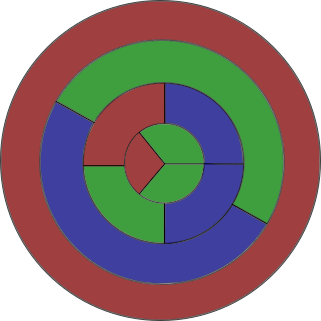
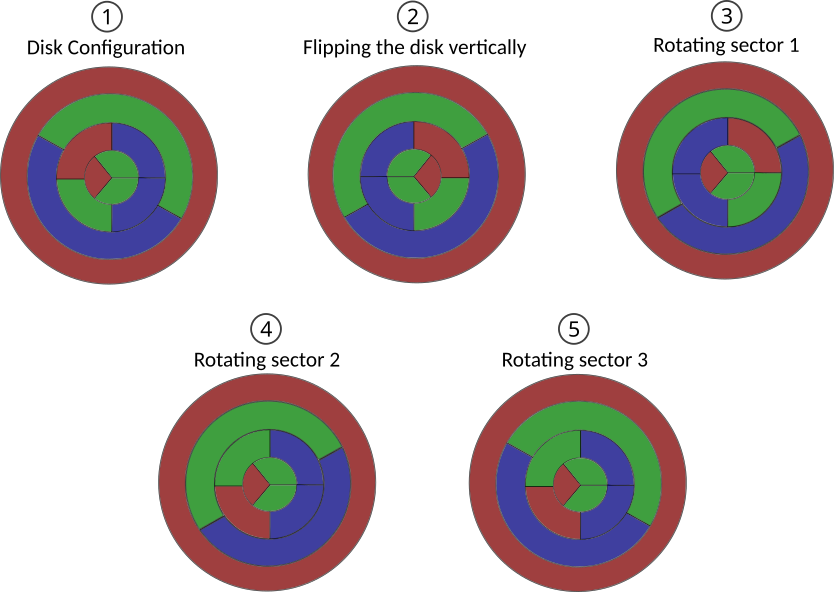

A disk is composed of $n$ sectors, where the $i^\text{th}$ sector is divided in $A_i$ isometric chunks.
Calculate the number of distinct colorings using $K$ colours.

Two colorings are equivalent if you can get one from the other by rotating each sector by **any angle**, and flipping the whole disk **vertically or horizontally** any number of times
## Notes

An example of a colouring of a disk composed of $4$ sectors with $A=[3,4,2,1]$ with $K=3$ colours. Note that all three colorings are equivalent and are considered as one.

